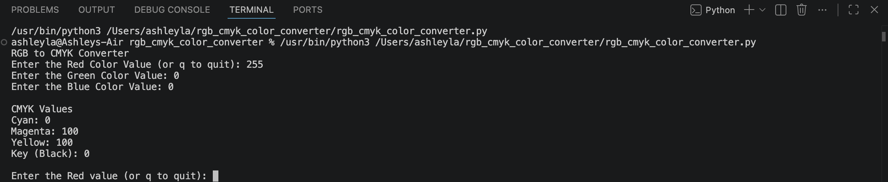
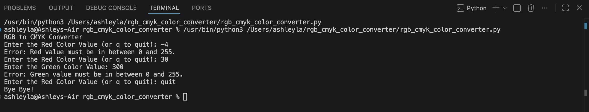
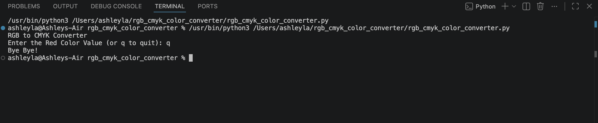

# RGB to CMYK Converter 
## Overview
This project is a Python application that converts RGB color values into CMYK percentages. Users enter red, green, and blue values (0–255), and the program calculates the corresponding CMYK values.
## Features
- Converts RGB to CMYK
- Validates user input
- Handles edge cases, such as pure black
- Displays CMYK values

## Technologies Used
Python

## Skills Demonstrated
- Functions
- Dictionaries
- Loops
- Conditional statements
- Input validation
- Problem solving

## How to Run
1. Download the project.
2. Open `rgb_cmyk_color_converter.py`.
3. Run the program.
4. Enter RGB values when prompted.

## Screenshots
### Successful Conversion

### Invalid Input

### Quit Program

